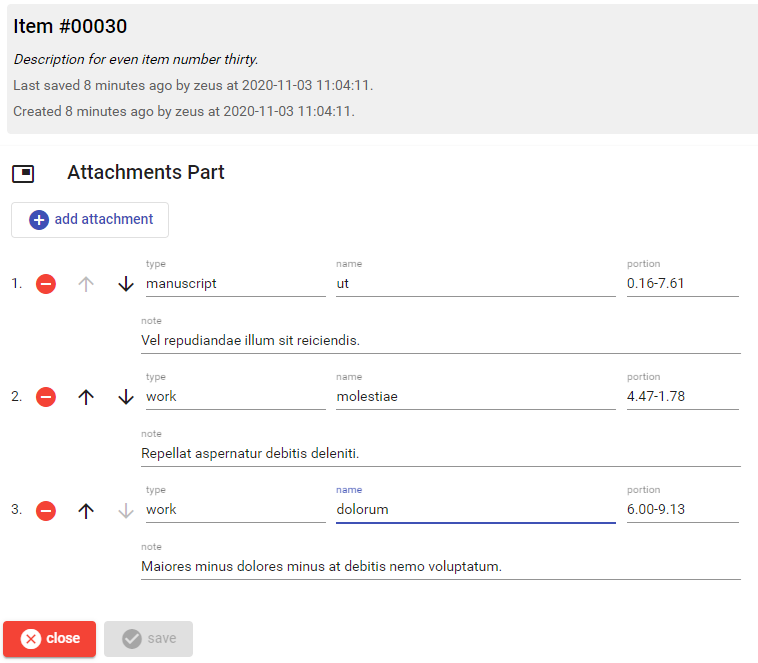

# Attachments Part

This part contains a list of attachments, either linked to a letter or a poetic text.

- to add a new attachment, click the `add attachment` button; a new editable row will be added at the bottom of the attachments list.
- to delete an attachment, click the red minus button in its row in the list.
- to move an attachment up or down in the list, use the corresponding arrow button in its row.
