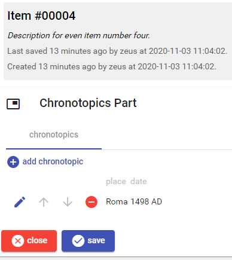
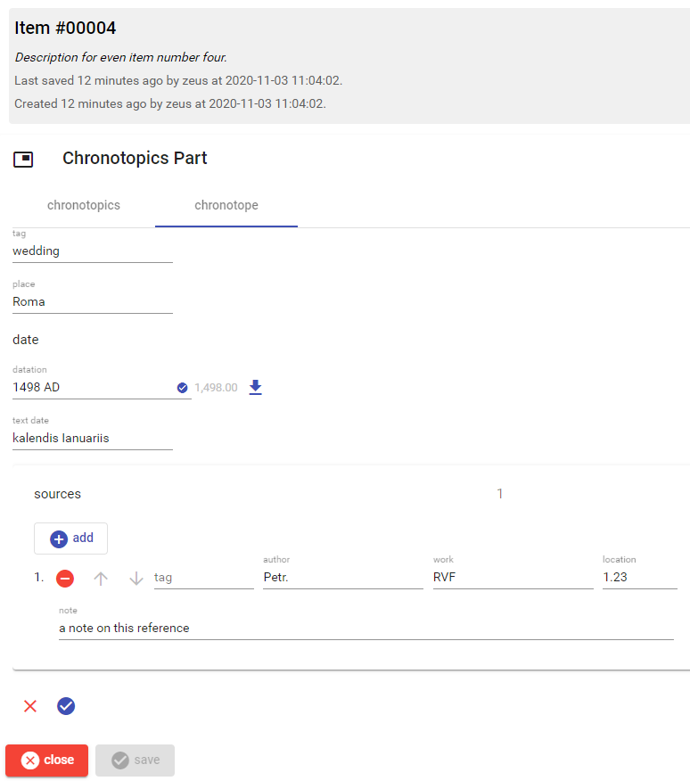

# Chronotopics Part

This part contains a list of place name and datation pairs.

- to *add* an entry, click the `add chronotope` button.
- to *edit* an entry, click the pen next to it.
- to *delete* an entry, click the red minus button next to it.
- to *move* an entry up or down in the list, click the corresponding arrow button.

Once you edit an entry, either existing or new, you are presented with this UI:

The datation is [edited as usual](historical-date.md).

You can add any number of documentary sources by clicking the `add` button in the `sources` section. Use the buttons next to each entry for deleting or moving it in the list.

Once you have finished editing, click the round checkmark button at the bottom to save the entry; or use the red X button to discard changes. In both cases, you will get back to the entries list.
