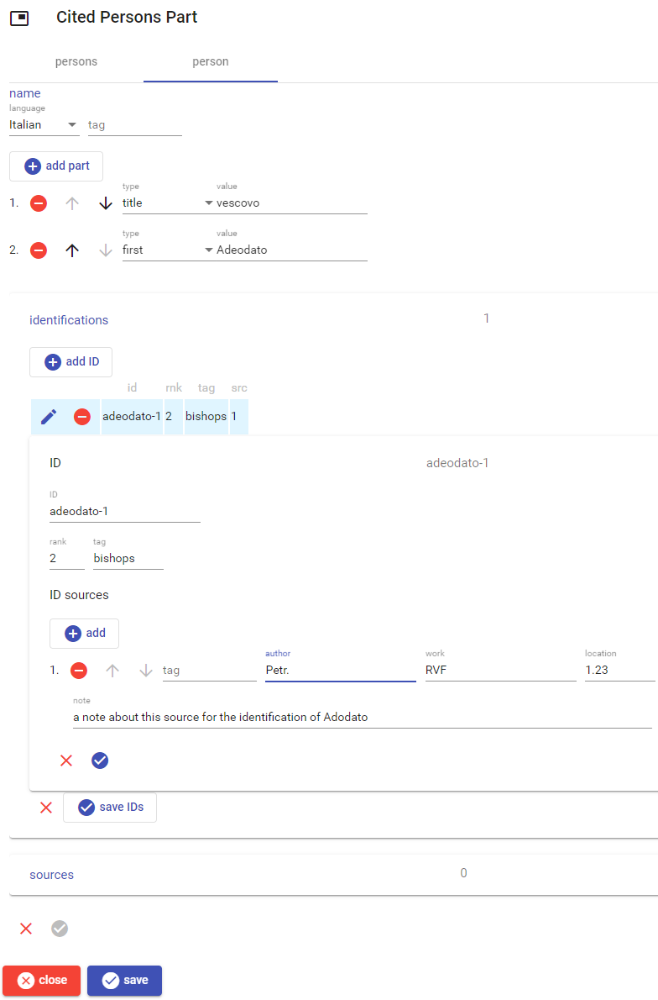

# Cited Persons Part

This part contains a list of cited persons. Each person cited is rather a (structured) name; there can then be zero or more proposed identifications for him/her, with their documentary sources.

You can _add_ a new person by clicking the `add person` button, _edit_ a person by clicking the pen button next to it, and _delete_ a person using the red minus button next to it.

When editing a person, you are presented with this UI:

The UI includes 3 sections for name, identifications, and sources. When you have finished editing the desired sections, click the round check button at the bottom to accept the changes, or the red `X` to discard them.

## Name

The person's name is a structured name, [edited as usual](./person-name.md).

## Identifications

The identifications are any number of proposed identifications for the cited person. Here too the editing is that used for the so-called "decorated IDs", i.e. arbitrary IDs with some metadata attached.

To save space and let users focus on persons, the identifications are collapsed into an `identifications` header. The number in it is the count of identifications present. Just click the header to toggle the section.

## Sources

The sources are any number of documentary references, [edited as usual](./doc-references.md).

As above, the sources are collapsed into a `sources` header. The number in it is the count of sources present. Just click the header to toggle the section.
