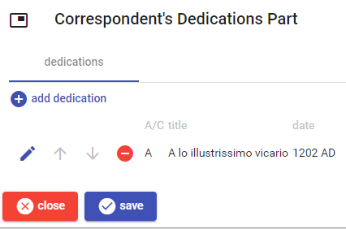
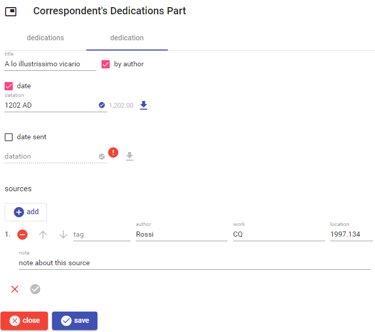

# Correspondent's Dedications

This part lists dedications involving the correspondent, i.e. by the correspondent to the reference author, or vice-versa.

To *add* a new dedication, click the `add dedication` button. To *edit*, *move*, or *delete* a dedication use the corresponding button next to each dedication in the list.

Once editing a dedication, either new or existing, the following UI appears:

The datatations are edited [as usual](./historical-date.md); as for the optional send date, you must first check the corresponding option and then edit it.

At the bottom you can edit the list of [documentary sources](./doc-references.md) for this dedication.

Once you have finished, click the check button at the bottom to save the dedication, or the red `X` button to discard changes.
