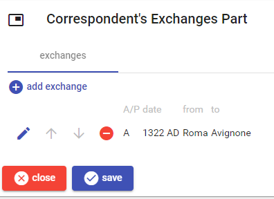
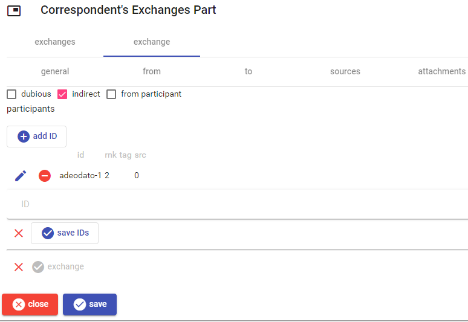
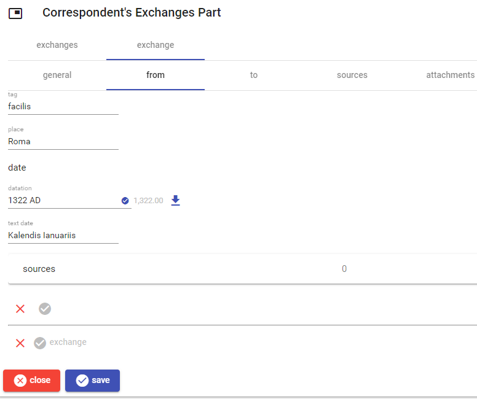
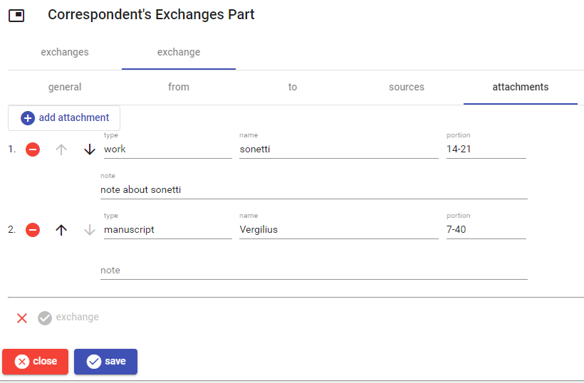

# Correspondent's Exchanges Part

This part contains the exchanges of works, manuscripts or other objects involving the correspondent.

To _add_ a new exchange, click the `add exchange` button. To _edit_, _move_, or _delete_ an exchange use the corresponding button next to each exchange in the list.

Once editing an exchange, either new or existing, a 4-tabs UI is presented, where you can enter general data, source and target places and datations, documentary sources, and eventual attachments.

When finished, save the exchange with the check button at the bottom, or discard changes with the red `X` button.

## General

Here you can enter some metadata and any number of participants, in the form of [decorated IDs](./decorated-ids.md). Once edited the IDs, remember to save them with the `save IDs` button.

## From or To

Here you edit chronotopics about source and target place, and start and end dates for the exchange.

[Edit the datation as usual](./historical-date.md) and click the button next to it when done; eventually, add any number of [sources](./doc-references.md) for the _from_ or _to_ indication.

When done, save the from or to indication with the check button, or discard changes with the red `X` button.

## Attachments

To *add* a new attachment, click the `add attachment` button. To *edit*, *move*, or *delete* an attachment use the corresponding button next to each attachment in the list.

