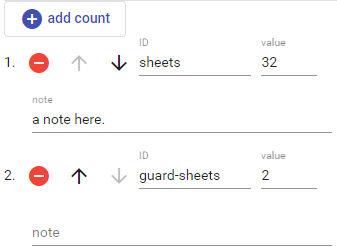

# Decorated Counts

This editor allows you to build a set of numeric counts, with some metadata attached.

This is typically used when you have to provide a variable list of named counts, like in a manuscript's description; there, you might want to provide any number of counts with different levels of precision, like `rowMinCount`, `rowMaxCount`, `lineCount`, `approxLineCount`, `lineMinCount`, `lineMaxCount`, `prickCount`, etc.; or different properties like columns, direction, blanks, ruling, execution, etc. The count could be exact, or just represent an average, or the most frequent value.

To _add_ a new count, click the `add count` button. Use the buttons next to each count to _delete_ or _move_ it.
