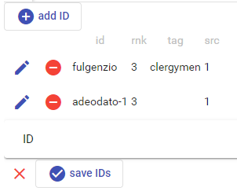

# Decorated IDs

This editor allows you to build a set of arbitrarily defined identifiers, with some metadata attached.

For instance, this set is used in the [cited persons part](./cited-persons-part.md) to list the proposed identification(s) of each cited person. Identifiers usually are defined by an internal convention, or refer to some external resource.

You can *add* a new ID by clicking the `add ID` button. In the list of IDs, you *edit* an item with the pen button, or *delete* it with the red minus button.

Whenever an ID is edited, either new or existing, the ID section below the list gets opened. The currently edited ID is highlighted in the list.

You can add as many sources as you want for the proposed identification, with the usual [documentary references editor](./doc-references.md) embedded in this one.

Once you have done editing the IDs, save them with the `save IDs` button at the bottom, or discard the changes with the red `X` button.
