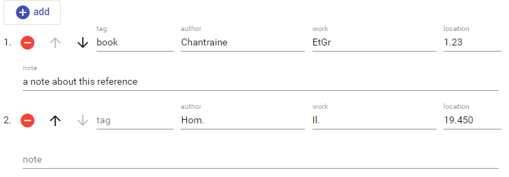

# Documentary References

This editor allows you to build a list of short documentary references. These can be bibliographic items, literary citations, archive documents, etc. and usually follow some citation scheme.

Conventionally, the two hierarchical fields representing a reference are named _author_ and _work_; but these two categories can be used with a wider meaning; e.g. the author might also be an archive reference, and the work a specific part in it.

To _add_ a new reference, click the `add` button. Use the buttons next to each reference to _delete_ or _move_ it.
