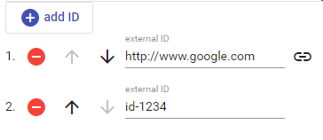

# External IDs

The external IDs editor allows you to build a list of identifiers pointing to some external resources. These might be just arbitrary strings, numeric IDs, GUIDs, URIs, or whatever type of ID the external source is using.

To *add* an ID, click the `add ID` button. Use the buttons next to each ID to delete or move it.

Whenever you add an ID which looks like an URL, the link button will be shown next to it: clicking this button opens that URL into another window. Of course, this will work only as far as the URI points to a real page or some stub. It might well be the case that it's just a LOD ID with no page or stub available, and in this case you would just end up with a page not found blank page in your browser. This is just a feature used to help you quickly opening some linked resource.
