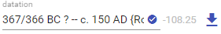
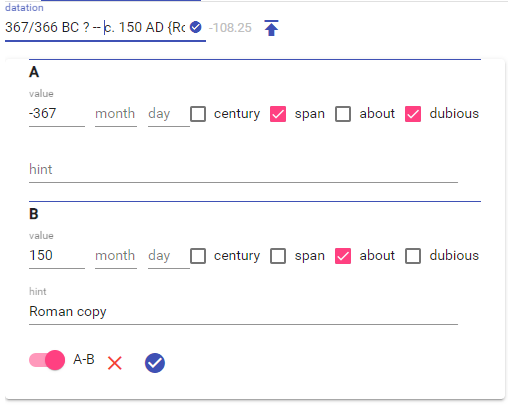

# Historical Datation

Editing a historical datation is usually accomplished in the same way across all the parts.

## Textual Editing

In its simplest and most compact form, the datation appears as text:

Here you can just type the datation following the conventions defined for it, and click the round check button to set it.

Tip: the grayed numeric value automatically calculated whenever you type is there just for reference; it represents the approximated numeric value used for sorting datations. Datations before Christ are negative numbers. When two points on the timeline are defined, the mid point between them is the starting point for this calculation.

To learn this convention, the quickest way is just making practice using the visual editor. In general, a single point in the timeline is represented by a numeric value. Use Arabic numbers for year, and Roman numbers for centuries. Append to it `BC` or `AD` as needed. You can prepend `c.`=_circa_ for an approximate datation, or a question mark `?` for a dubious datation (e.g. `c.23 AD?`).

You can eventually add a short note at the end, wrapped in braces (`{}`). This is used to represent the hint which motivates the datation. For instance, `25 BC {marriage of Julia and Marcellus}` shows that the year 25 BC is the consequence of the fact that the dated event is connected to the marriage of Julia and Marcellus, which happened in 25 BC.

When typing two points in the timeline, separate them with a double dash `--`.

## Visual Editing

If you prefer switching to a more visual editing, click the arrow button to open the visual editor:

In this editor, you can choose between 1 or 2 points in the timeline (use the `A-B` switch to toggle). For each of these points, you just enter a numeric value for the year or century, and eventually for the month and day. You can also check all the options that apply, and optionally add a free text hint about the datation.

Once finished with visual editing, click the round check button to accept changes and close the visual editor; or just the red `X` to discard them. When changes are accepted, the text representing the datation is automatically updated.

Conversely, whenever you type in the top text box your changes are immediately reflected in the visual editor, when it is open.
