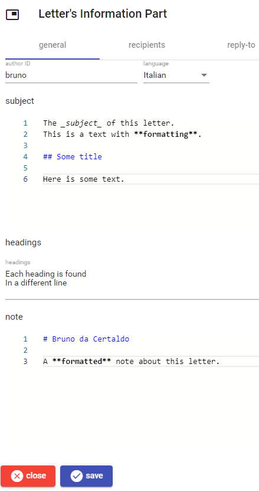

# Letter's Information Part

Essential information about a letter.

The subject and note text is rich text which can get some basic formatting using [Markdown](https://www.markdownguide.org/).

Letter's headings can be entered in the headings box, one per line. The recipients and reply-to sections both include a list of [decorated IDs](decorated-ids.md).

