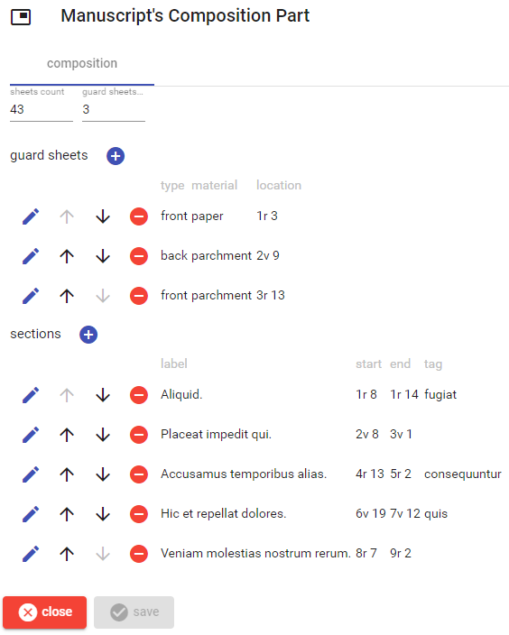

# Manuscript's Composition Part

This part describes the content composition of the manuscript: besides the count of sheets and guard sheets, you can enter details about each guard sheet and each section of content.

In both lists, to _add_ a new item, click the plus button. To _edit_, _move_, or _delete_ an item use the corresponding button next to each item in the list.

## Guard Sheet

Each guard sheet, either new or existing, is edited in this UI: just fill the fields and click the check button to save, or the red `X` button to discard changes. The datation is edited [as usual](./historical-date.md).

## Section

Each section, either new or existing, is edited in this UI: just fill the fields and click the check button to save, or the red `X` button to discard changes. The datation is edited [as usual](./historical-date.md).

