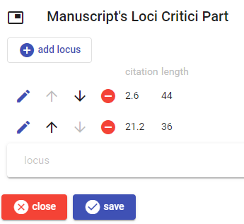
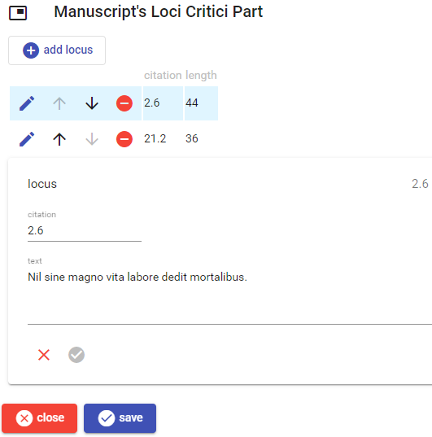

# Manuscript's Content Loci Part

This part collects some short text passages useful for the analysis of the manuscript (_loci critici_).

To _add_ a new locus, click the `add locus` button. To _edit_, _move_, or _delete_ a locus use the corresponding button next to each locus in the list.

Once editing a locus, either new or existing, the following UI appears. Just fill its fields and click the check button to save, or the red `X` button to discard changes.

