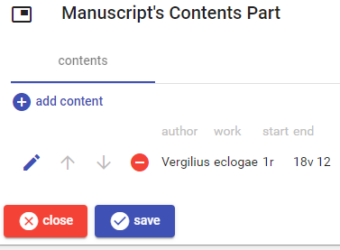
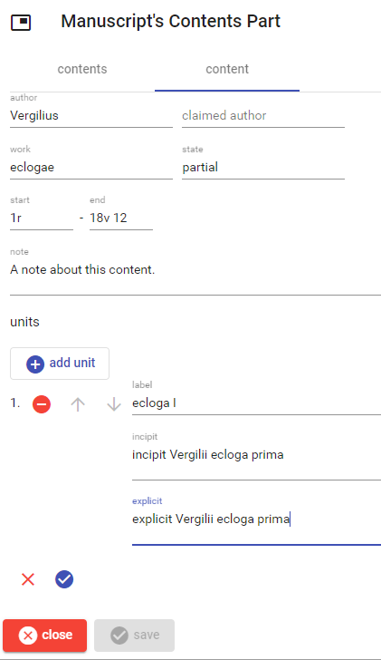

# Manuscript's Contents Part

To _add_ a new content, click the `add content` button. To _edit_, _move_, or _delete_ a content use the corresponding button next to each content in the list.

Once editing a content, either new or existing, the following UI appears. Just fill its fields and click the check button to save, or the red `X` button to discard changes.

The content section edited here can contain any number of units, which are added, moved and deleted in a similar way.

