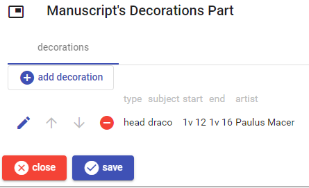
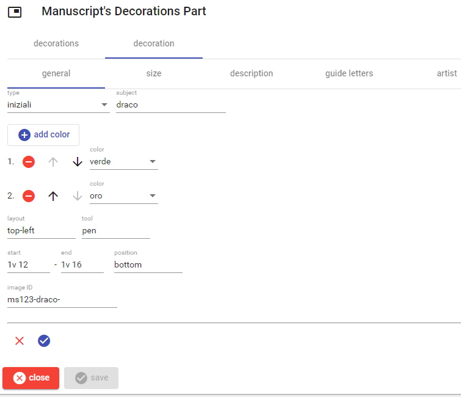
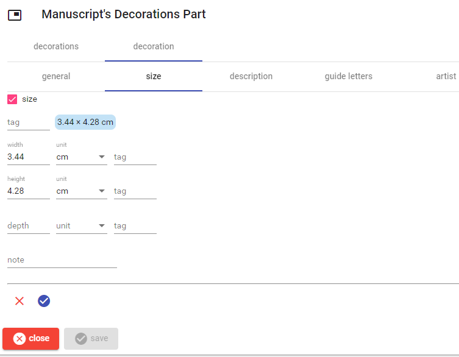
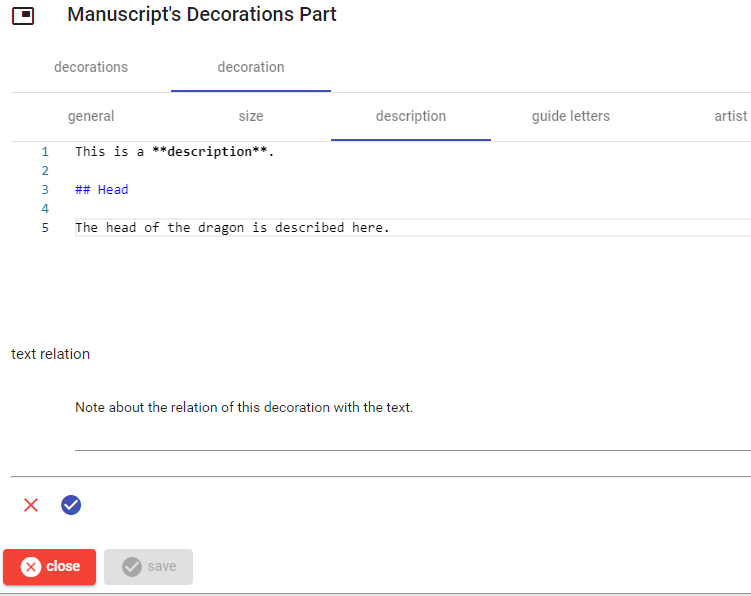
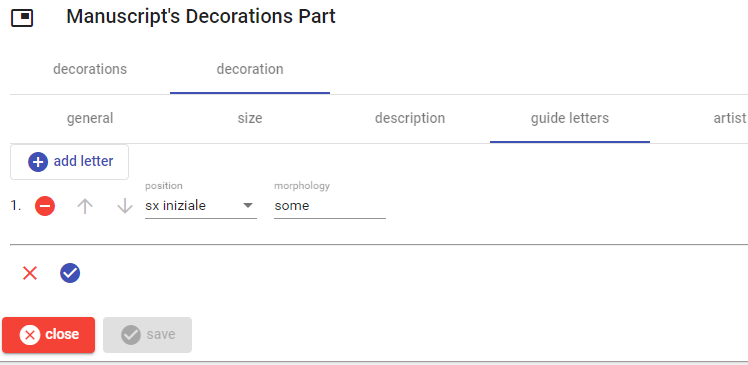
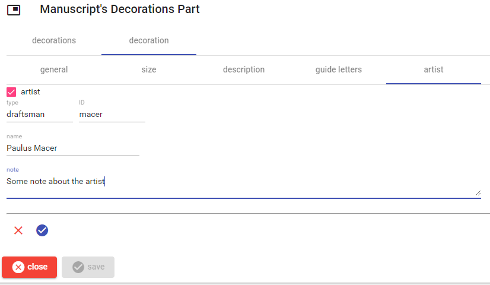

# Manuscript's Decorations Part

This part describes the manuscript's decorations.

To _add_ a new decoration, click the `add decoration` button. To _edit_, _move_, or _delete_ a decoration use the corresponding button next to each decoration in the list.

Once editing a decoration, either new or existing, a UI with 5 sections appears: general, size, description, guide letters, artist.

When finished, save the decoration with the check button at the bottom, or discard changes with the red `X` button.

## General

This section contains general information: colors, layout, tool, start and end sheet, position, and image ID.

## Size

This section contains the [size](./physical-size.md) of the decoration.

## Description

This section contains a [Markdown](https://www.markdownguide.org/) text with the description of the decoration.

## Guide Letters

This section lists all the guide letters if any. You can add, move and delete each letter as specified above for the decorations list.

## Artist

This section contains some information about the artist. To enter it, check the `artist` option and fill the fields.

