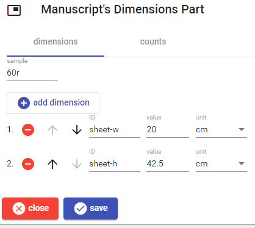
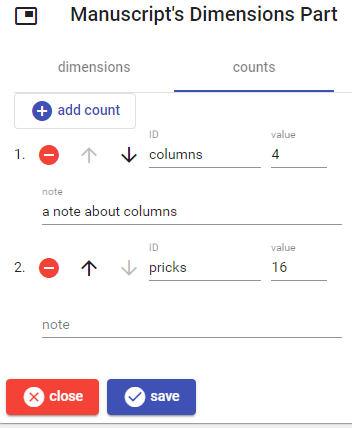

# Manuscript's Dimensions Part

This part contains various dimensions and counts for any measurable thing in a manuscript.

The part contains 2 sections: dimensions and counts.

## Dimensions

This part contains a list of dimensions related to any thing we want to measure. Each thing is specified with a conventional ID, and has a numeric value and a measurement unit.

To _add_ a new dimension, click the `add dimension` button. To _edit_, _move_, or _delete_ a dimension use the corresponding button next to each dimension in the list.

## Counts

The counts section allows entering any number of counts with different levels of precision. For instance, you might have `rowMinCount`, `rowMaxCount`, `lineCount`, `approxLineCount`, `lineMinCount`, `lineMaxCount`, `prickCount`, etc. It also allows descriptions for properties like columns, direction, blanks, ruling, execution, etc., eventually with a count (which might represent an average, or the most frequent value, etc.).

So here too each numeric value has its own conventional ID, representing the thing being counted. Adding, moving and deleting counts is done as explained above for dimensions.

