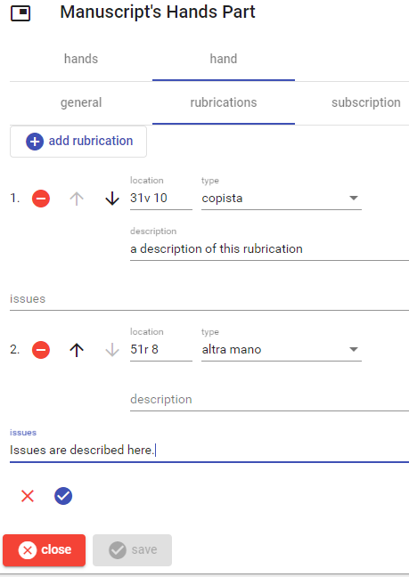

# Manuscript's Hands Part

This part lists the hands found in a manuscript. Usually, each hand ID should have a corresponding [person hand](./person-hand-part.md) item's part.

To _add_ a new hand, click the `add hand` button. To _edit_, _move_, or _delete_ a hand use the corresponding button next to each hand in the list.

Once editing a hand, either new or existing, a UI with 3 section appears: general, rubrications, and subscription.

## General

In this section you can enter the hand's internal ID, the type of identification reason, the start and end sheet for that hand, and an optional note about its extent.

## Rubrications

This section lists all the rubrications. Use the buttons as explained above for the hands list.

## Subscription

This section optionally contains some data about the subscription. Check the `subscription` option if you want to enter it.

