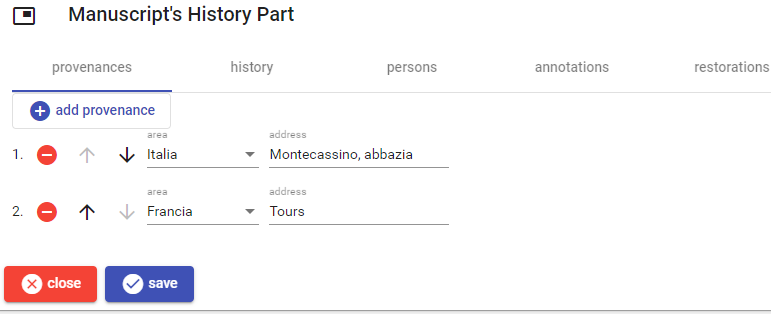
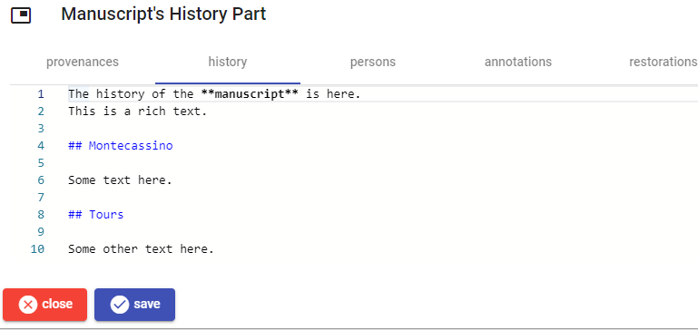
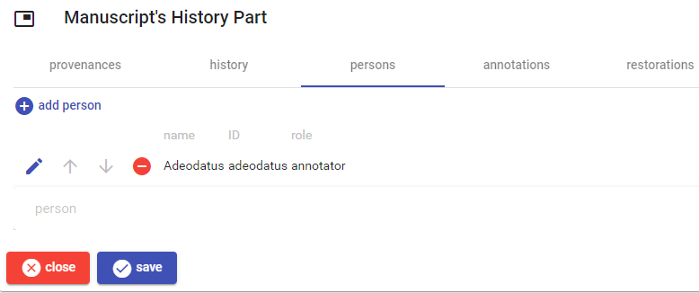
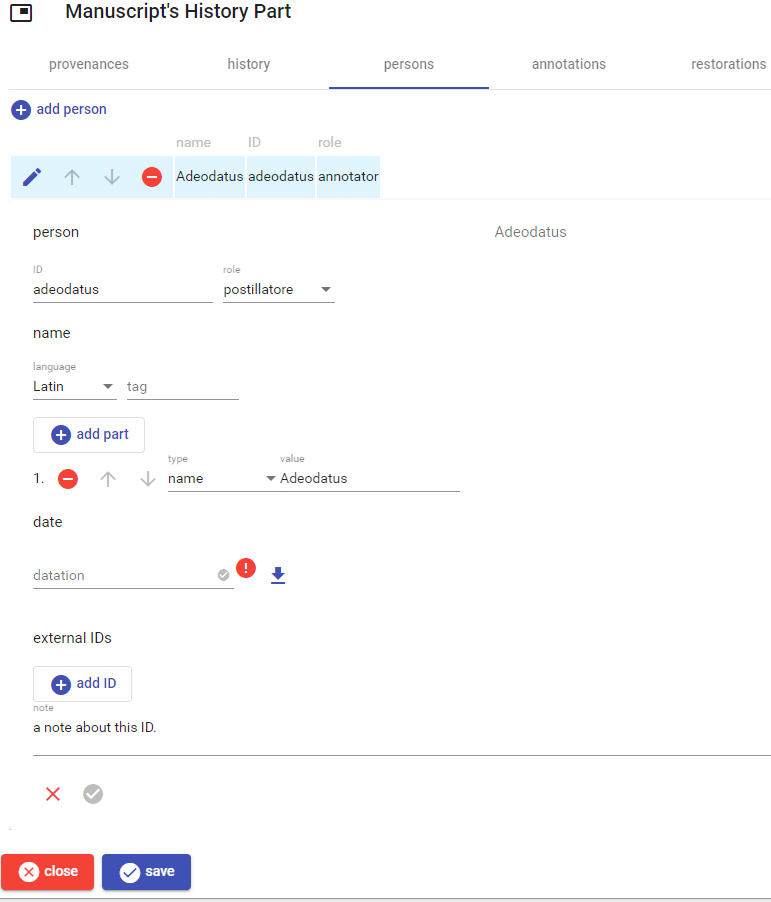
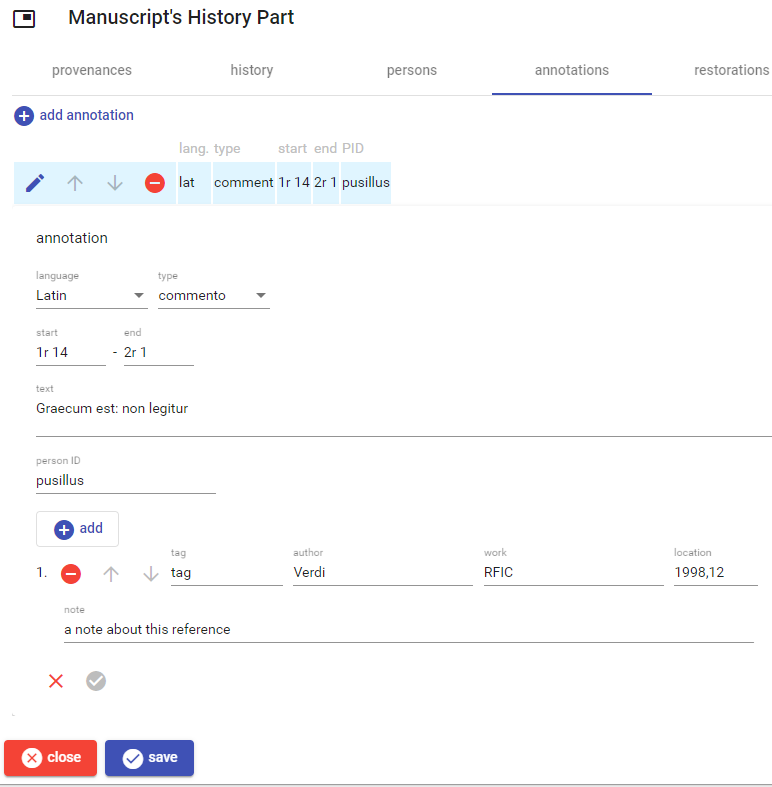
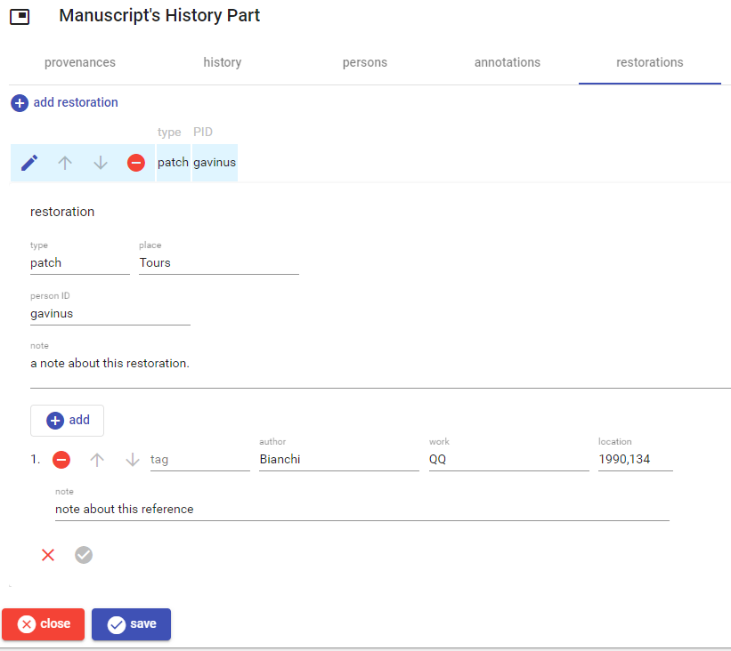

# Manuscript's History Part

This part contains data about the manuscript's history. Its UI is organized in 5 sections: provenances, history, persons, annotations, and restorations.

## Provenances

This section lists all the provenances for the manuscript.

To _add_ a new provenance, click the `add provenance` button. To _edit_, _move_, or _delete_ a provenance use the corresponding button next to each provenance in the list.

## History

This section contains the [Markdown](https://www.markdownguide.org/) text with the history of the manuscript.

## Persons

This section lists all the persons involved in the history of the manuscript. To add, edit, move, or delete a person use the same procedure explained above about the provenances.

Once you edit a person, either new or existing, the person editor gets displayed below the list. Here, [person name](./person-name.md), [datation](./historical-date.md), and [external IDs](./external-ids.md) are edited as usual.

When you have finished, click the check button to save the person, or the red `X` cancel button to discard changes.

## Annotations

This section lists all the annotations. The documentary references are edited [as usual](./doc-references.md).

## Restorations

This section lists all the restorations. The documentary references are edited [as usual](./doc-references.md).

