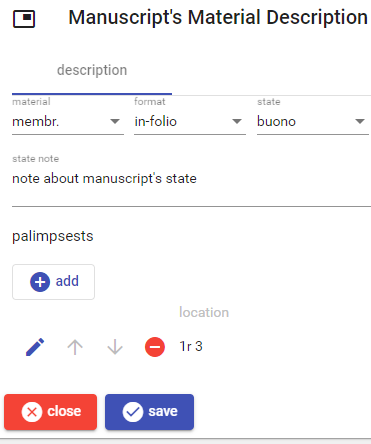

# Manuscript's Material Description

This part contains the manuscript's material description: material, format, state and its description, and the list of eventual palimpsest sheets.

To _add_ a new palimpsest, click the `add` button. To _edit_, _move_, or _delete_ a palimpsest use the corresponding button next to each palimpsest in the list.

Once you edit a palimpsest, either new or existing, the following UI appears; the datation is entered in the [usual way](./historical-date.md).

