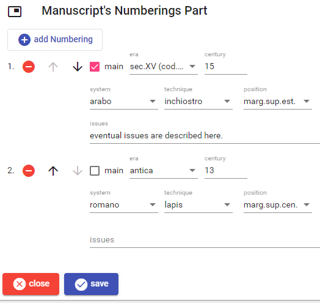

# Manuscript's Numberings Part

This part lists the sheet numberings present in the manuscript. To _add_ a new numbering, click the `add numbering` button. To _edit_, _move_, or _delete_ a numbering use the corresponding button next to each numbering in the list.

