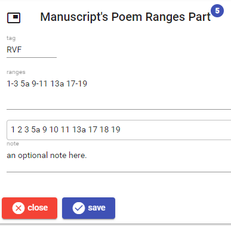

# Manuscript's Poem Ranges

This part defines the sequence of poems or other types of numbered compositions in a manuscript. This is used to compare the sequence of poems in different mss of Petrarch's RVF.

Each poem is represented by its number, which can be followed by any number of non-digit characters (e.g. `5a`).

In ranges, each value is a string representing "alphanumerics", i.e. either numbers (a string with only digits), or at least 1 digit followed by any combination of digit or non-digit characters. These alphanumerics are sorted according to the following criteria:

- an alphanumeric with only digits (e.g. `12`) is sorted by its numeric value.
- an alphanumeric with non-digit characters (e.g. `12a`, `12b1`, etc.) is sorted first by its numeric value, and then alphabetically by its string suffix.

You can express a sequence of values with a dash, e.g. `12-17` means 12, 13, 14, 15, 16, and 17. Such ranges can be expressed only for alphanumerics with digits only, as they would be ambiguous in other cases: e.g. 12-15 means 12, 13, 14, 15; but 12-15a could be interpreted in a number of different ways, as we have no predefined convention for the non-digits part. For instance, a valid range could be `1-13, 15-19, 20a, 21-36, 38, 50-67`.

In the editor, you just enter the ranges following the syntax explained above; when typing, the sequence gets analyzed and the resulting, exploded list of all the values is shown below the text box.

