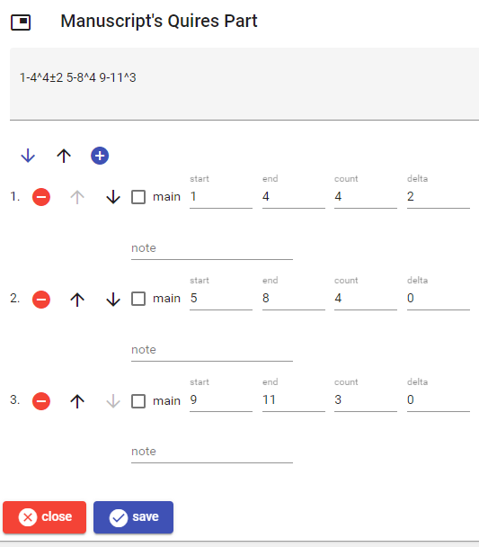

# Manuscript's Quires Part

This part describes the quires of a manuscript, using a simplified collation formula or its visual editor.

The quickest way to describe quires is by entering a collation formula, like `1-3^4-1`. In this syntax there are any number of tokens, separated by whitespace. Each token has the syntax `N-N^N±N {note}`, where `-N` and `±N` are optional:

- an initial asterisk (`*`) marks the quire as the main (=paradigmatic) one.
- `N` or `N-N` is the gatherings range (=when only `N` is specified, both are assumed to be equal);
- `^` introduces the sheets count;
- `±N` (or `~N`, which can be easier to type on a keyboard) adds an exceptionally missing or additional sheet count ("delta" in the UI).
- `{note}` is an optional short note, delimited by braces.

Thus for instance `1-3^4~1 *4-7^4 {a note}` represents:

- quire 1 for sheets 1-3 which refer to a 4-sheets quire with delta=1.
- quire 2, the main one (the one used as the reference sample), for sheets 4-7 which refer to a 4-sheets quire, followed by a note.

Once you have entered the formula, click the arrow-down button to analyze it in the visual editor. Or, inversely, build the quires using the visual editor and click the arrow-up button to build the collation formula.

In the visual editor, to _add_ a new quire click the plus button. To _edit_, _move_, or _delete_ a quire use the corresponding button next to each quire in the list.

