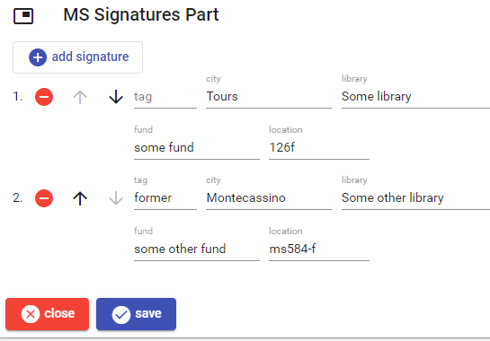

# Manuscript's Signatures Part

This part lists the signature(s) of a manuscript. At least 1 signature should be present. The signature with empty tag is the default (current) signature. Other signatures may be added for historical reasons, and should have a tag.

To _add_ a new signature, click the `add signature` button. To _edit_, _move_, or _delete_ a signature use the corresponding button next to each signature in the list.

