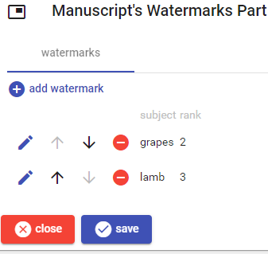
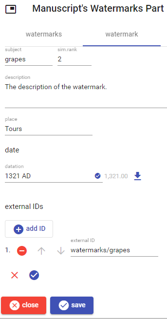

# Manuscript's Watermarks Part

This part lists the watermarks in a manuscript. To _add_ a new watermark, click the `add watermark` button. To _edit_, _move_, or _delete_ a watermark use the corresponding button next to each watermark in the list.

Once editing a watermark, either new or existing, the following UI appears. Here, [datation](./historical-date.md) and [external IDs](./external-ids.md) are edited as usual.

When finished, click the check button to accept changes, or the red `X` button to discard them.

