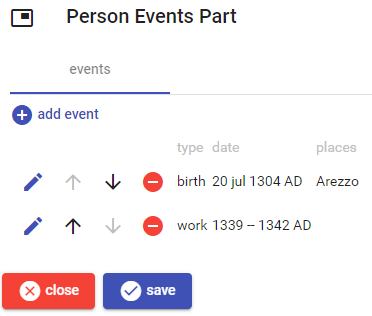
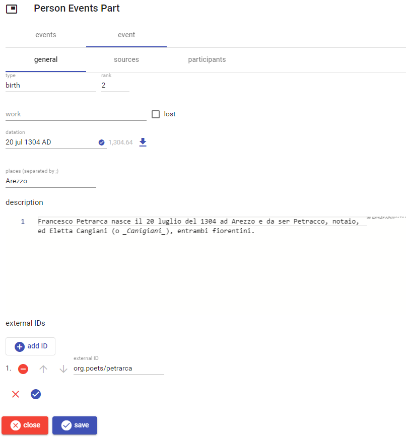
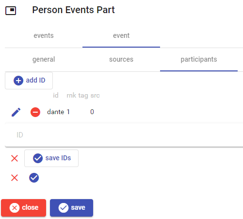

# Person Events Part

This parts lists the relevant events in a person's life.

To *add* a new event, click the `add event` button. To *edit*, *move*, or *delete* an event use the corresponding button next to each event in the list.

Once editing an event, either new or existing, the event editor appears, organized into 3 sections: general, sources, and participants.

## General

General information about the event. The date is [edited as usual](./historical-date.md). The description is a rich [Markdown](https://www.markdownguide.org/) text.

## Sources

The sources of the event are [documentary references](./doc-references.md).

## Participants

The participants section lists all the participants for this event. Each participant is identified by a conventional, arbitrarily defined ID (e.g. `dante` for Dante Alighieri).

IDs here are edited as usual for [decorated IDs](./decorated-ids.md).

