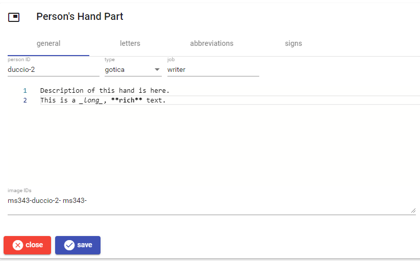

# Person's Hand

This part contains the description of a person's hand. The editor contains 4 sections: general, letters, abbreviations, and signs.

## General

This section contains the person internal ID, the hand's writing type, the person's job, a full [Markdown](https://www.markdownguide.org/) description of the hand, and any number of image IDs.

Image IDs are typed in a text box in any number, separated by space.

## Letters

This section contains descriptions about initials, corrections, and punctuation.

## Abbreviations

This section contains a [Markdown](https://www.markdownguide.org/) description of abbreviations.

## Signs

This section contains a list of any number of graphical signs descriptions.

To _add_ a new sign, click the `add sign` button. To _edit_, _move_, or _delete_ a sign use the corresponding button next to each sign in the list.

Once editing a sign, either new or existing, you can enter its arbitrary ID (unique in the context of this hand), its type, image ID, and [Markdown](https://www.markdownguide.org/) description.

