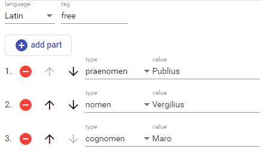

# Person Name

The person name editor allows you to edit a structured personal name.

This model includes a language for the name, an optional tag with any useful classification, and 1 or more name's parts.

Each name's part has a type and a value. You pick the type from a list, and enter the value accordingly.

Use the plus button to add a new part, and the buttons next to each part to delete or move it up or down.
