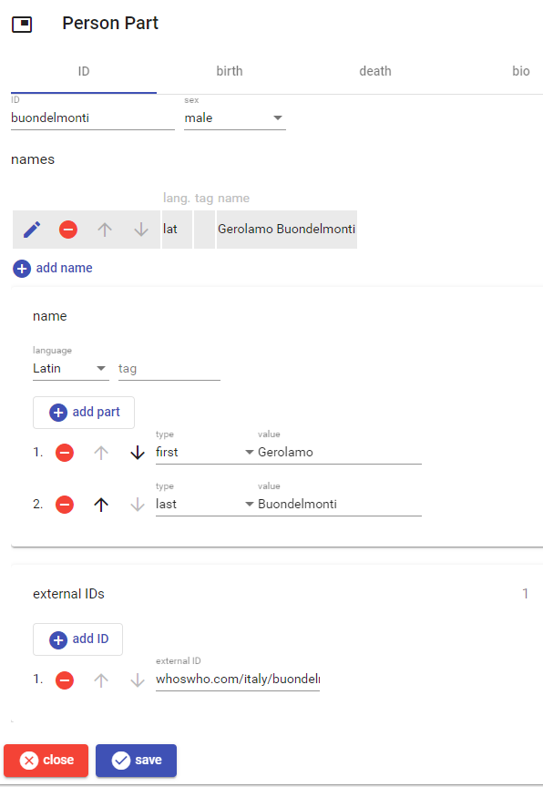

# Person Part

This part contains a person's biographic data. The editor contains 4 sections: ID, birth, death, and bio.

## ID

This section includes the essential ID data for the person: an arbitrarily defined internal ID, sex, 1 or more [structured names](./person-name.md), and any number of [external IDs](./external-ids.md).

## Birth and Death

These two sections include the place and [date](./historical-date.md) of birth and death.

## Bio

This section includes a biographic profile in [Markdown](https://www.markdownguide.org/).

