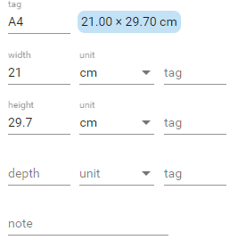

# Physical Size

This editor allows you to define a physical 1D, 2D, or 3D size.

According to the number of sizes, you can enter the values for width, height, and depth. Just leave without a value the dimension you do not need.

Each dimension can be entered in any of the available units. You do not need to use the same unit for all the dimensions, even though this is usually the case.

At least 1 dimension must be specified for the size to be valid.
