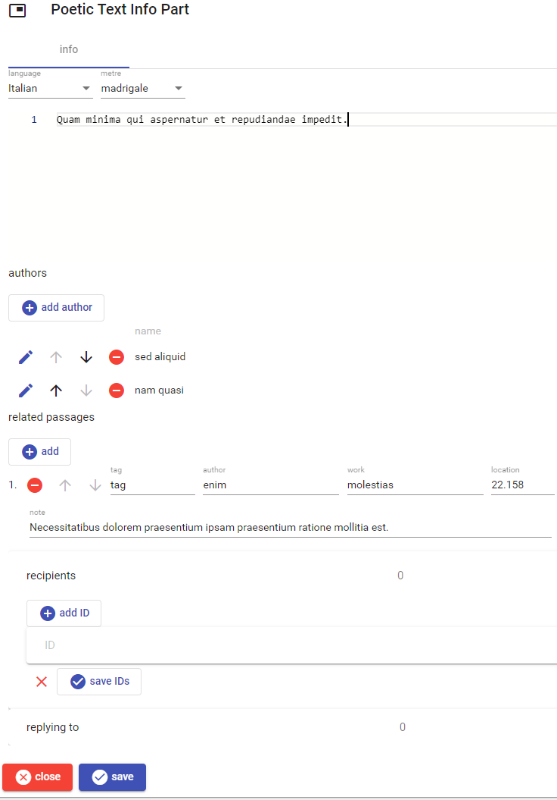
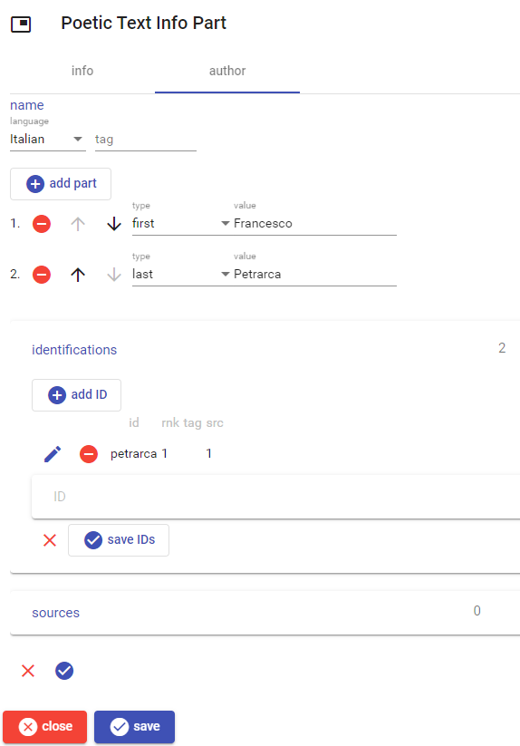

# Poetic Text Info Part

This part contains essential information about a poetic text: language, metre, [Markdown](https://www.markdownguide.org/) description, authors, and [related passages](./doc-references.md).

When editing an author, you can enter his [structured name](./person-name.md), plus eventually proposed [identifications](./decorated-ids.md) and [sources](./doc-references.md). The recipients and reply-to expandable sections both include a list of [decorated IDs](decorated-ids.md).

