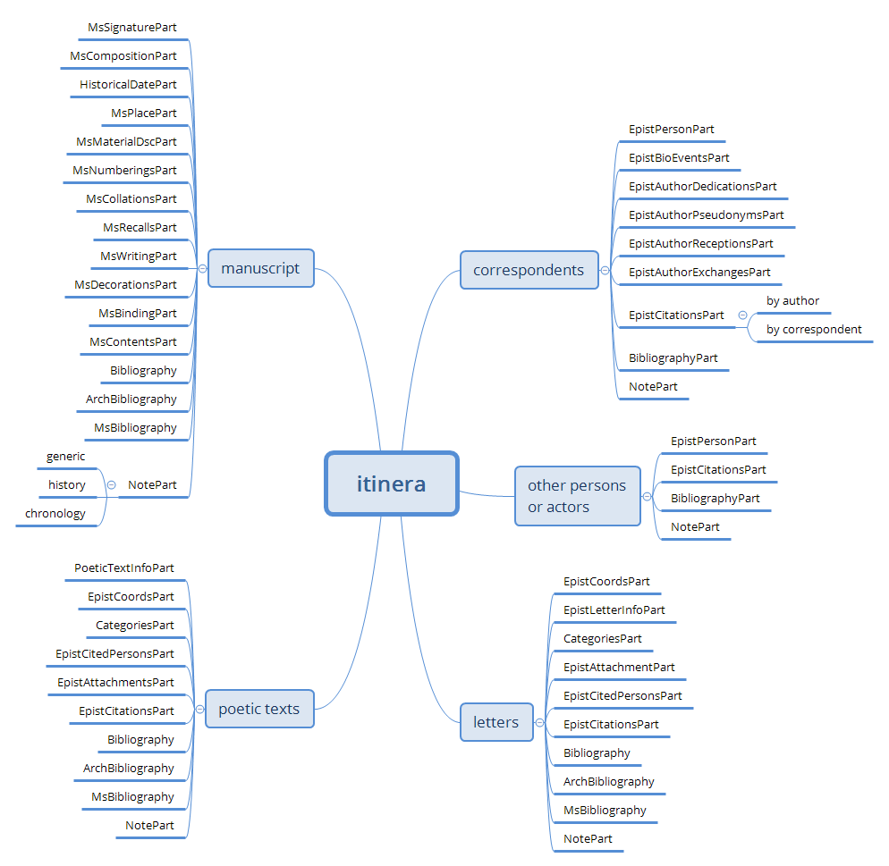
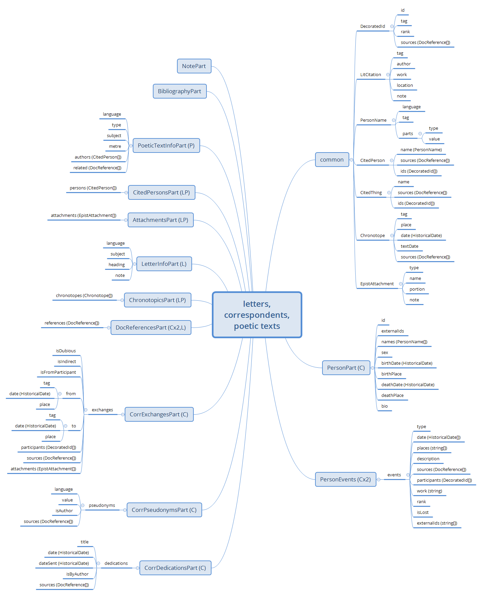
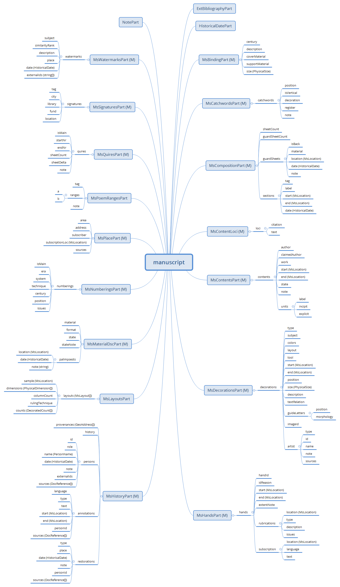
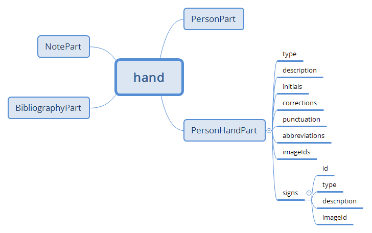
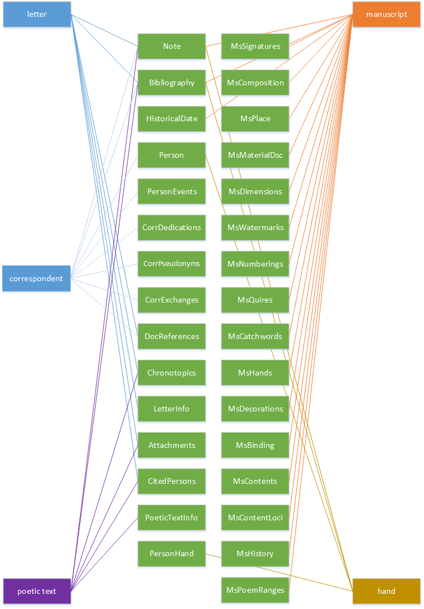
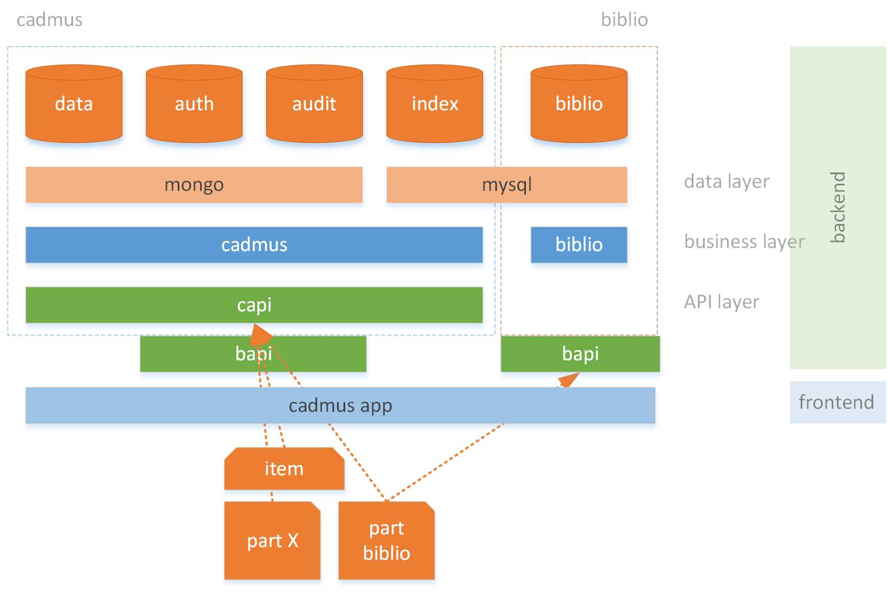

# Itinera Data Architecture Overview

The Cadmus data model for the _Itinera_ project includes 5 item types:

- letter
- correspondent
- poetic text
- manuscript
- hand

Of these models, letter, correspondent, and poetic text belong to the epistolography domain; manuscript and hands to the codicology domain.

## Epistolography

## Codicology

The hand is somewhat at the crossing of the epistolographic and codicologic domains, as far as it defines a person, but as related to the handwriting found in a manuscript.

## Items and Parts

Items and parts can be sketched in this picture:

## Bibliography

Itinera uses an external bibliography, fed by its independent API. This allows for a "top-down" approach, where bibliographic items are entered just once in a standalone database, and then used across all the items and parts of the Cadmus-based system.

Thus, when editing a bibliography part, you are really using two distinct resources:

- the Itinera database, where references to some bibliographic items are stored.
- the bibliographic database, where the full bibliography is stored, to be consumed by the Cadmus system or by any other 3rd party application.

Both these databases are accessed (either for reading or writing) via their own APIs: we thus have 2 different web APIs, one for Cadmus Itinera, and another for bibliography. Both APIs are protected; yet, in this configuration authentication and auditing are shared: so, you just need to login once in the Cadmus app, and use both these APIs.

When editing a bibliography part, you variously browse the bibliographic database to find the desired records to add a reference to, and pick them for that part. For each picked record you can also add an optional tag (used to categorize or group your picks) and an optional note. So, the part just stores each reference (with the bibliographic record ID plus a human-readable label), eventually with a couple of metadata (tag and note); the full bibliographic data is stored elsewhere, in an external resource.

At the same time, when editing the part you can also add new records to this external resource, or edit or delete its existing records. Thus, from the user's point of view the experience is not so different from a bottom-up approach: he just enters bibliographic records as he needs to reference them. Yet, in this way he's not only adding bibliographic references to an item; but also creating a full, standalone bibliographic database by means of progressive additions.

This database has a completely independent modeling, which takes no dependency from the Cadmus architecture; it's a simple bibliographic relational database. Some features of this database are noteworthy:

- the design is focused on the work, having any number of authors and keywords. Each work can also be contained in a container (e.g. a journal, a collection of proceedings, a miscellany book, etc.); the container in turn is just another work, with the only difference that it cannot have a container. This allows to enter bibliographic records representing containers just once, rather than repeating them whenever a contained work needs to be entered.

- the design ensures that every author and work has its own ID, guaranteed to be unique also beyond the scope of the database itself. This is possible because this ID is a GUID, rather than some more scoped value like an arbitrary number. This is very useful for connecting such data to the external world, eventually via LOD.

The following schema summarizes the Cadmus Itinera layers:

At the bottom of the layers stack, corresponding to the top of this schema, there are 5 databases, using MongoDB (for data, authentication, and auditing) and MySql (for real-time data indexing). Also, an independent MySql database is used by the bibliography system. This is the _data layer_.

The Cadmus core components deal with all these data except bibliography, which being independent is handled by the bibliography core. This is the _business layer_, with the core system logic.

These data with the functions operating on them are exposed via two distinct RESTful APIs: one belongs to the Cadmus system (`capi`), the other to the bibliography system (`bapi`).

Finally, the frontend web application leverages both APIs. Usually, a Cadmus item like that depicted at the bottom of the schema, and its parts like part X, are managed via the Cadmus API only. In the case of the external bibliography part instead, both the APIs are used: one to fetch bibliographic records and eventually add, modify, or delete them (`bapi`); another to edit the part as usual (`capi`): in this case, the part just contains a set of references to bibliographic records, eventually accompanied by some metadata.

In this scenario, the bibliographic system is completely independent and has no notion of Cadmus; it could be easily used in any other environment as an independent resource. Databases are independent, too: both can exist without the other. In fact, it's only a single part type which uses the external bibliographic resource; all the other parts completely ignore it, and can be edited even if that resource is not available.

The only connection between the two databases (`data` and `biblio`) is represented by the ID of the bibliographic records used in the external bibliography part to reference them. This is just a string, which in this case corresponds to a GUID (as the GUID is the ID for works in the bibliographic system); if using other bibliographic sources it could correspond to a number, an arbitrary string, etc. Using the GUID here ensures the stability of the ID whatever its context, so that we can confidently store references to these external records.

Thus, this scenario represents the model for integrating external resources into the Cadmus editor: here we have a completely independent resource, with its own database, software components, and public web API, which gets used by a specific part editor.

Further, here the integration is very high, because the bibliographic system can share the authentication and auditing databases already used by Cadmus. Configuring the bibliographic system in this way allows users to directly edit the bibliographic part, without having to first login in that subsystem; rather, the same account _can_ be used for both Cadmus and bibliography.

This makes this integration completely transparent to the end user, who edits the bibliography part just like any other, without even knowing that bibliography is a completely independent system. Effectively, Cadmus here is acting as a sort of editing hub, where different resources converge to be edited in the same way, inside the same application. Anyway, the same could apply to any other scenario involving editing or just using a third party available resource: the part editor can be a full fledged editing application, operating with any number of resources, either coming from Cadmus or from the external world.

Thus, Cadmus provides an editing framework which can expand in both directions: internally, by adding new parts; and externally, by adding new third-party resources.
