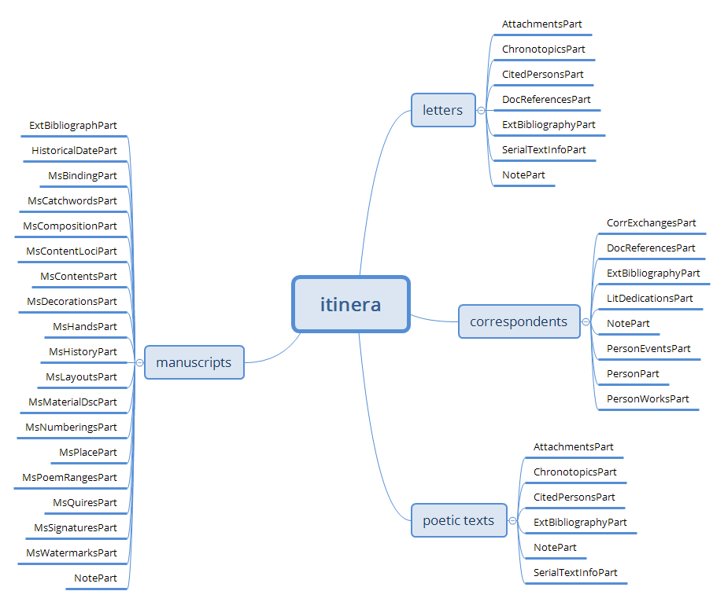
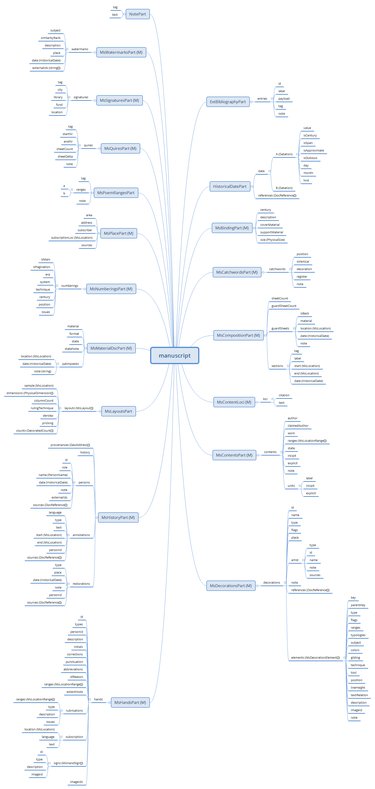

# Itinera Data Architecture Overview

The Cadmus data model for the *Itinera* project includes 5 item types:

- letter
- correspondent
- poetic text
- manuscript
- hand

Of these models, letter, correspondent, and poetic text belong to the epistolography domain; manuscript and hands to the codicology domain.

## Epistolography

## Codicology

The hand is somewhat at the crossing of the epistolographic and codicologic domains, as far as it defines a person, but as related to the handwriting found in a manuscript.

## Items and Parts

Items and parts can be sketched in this picture:

